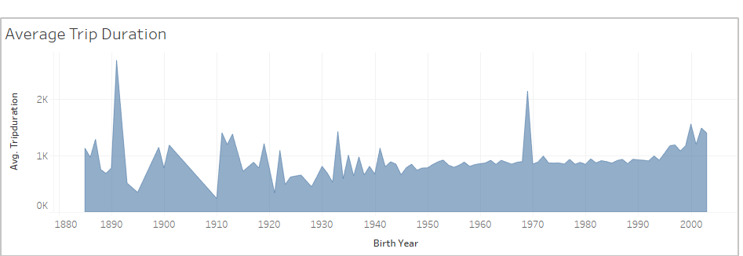
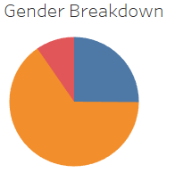

# Analysis of Citi Bike Data using Tableau

See Tableau Story ->>> [Link to Dashboard](https://public.tableau.com/app/profile/brett.bertoni/viz/NYCCitiBike_16573945235420/NYCStory?publish=yes)

## Overview

Using bike sharing data to determine how to successfully implement a bike sharing service in Des Moine, Iowa. Data was provided in CSV format. Tableau was used to create visualizations to make the data more meaningful and draw conclusions which help create a successful business plan. In the process, data cleaning was needed so the CSV file was read in to a dataframe where some work was done. The dataframe was then exported back to CSV format and then re-loaded in to Tableau. Please see the full story (link above).

## Results

The most popular times for bike rentals are during commute times (approx. 7am-9am & 4pm-7pm). Generally speaking, day time (9am-4pm), is also active.

This heatmap reinforces what the previous chart shows (peak hours tend to be commuting times). It also shows which days of the week tend to have the most rentals. Weekdays tend to have very busy rental times around commuting times whereas weekends are generally active from 9am-6pm.

This pie chart represents the total users broken down by gender: Male (orange), Female (blue), unknown (pink). Males make up a majority of the customer base. 

This heatmap shows every bike (represented as bike id) and the amount it is used. The darker and larger the marker, the more the bike is used. This is important to note as the bikes which get used heavily will generally need more maintenance/repairs. Certain times (not peak hours) should be set aside for such work. 

The number of bikes rented vs the number minutes the bike is rented for. The most popular rental durations are a very short amount of time (5-6 minutes). It also important to note that gender does not seem to make a difference. Although there are a high number of males who use the service overall, both males and females tend to have similar tendencies.

First, a look at subscriber vs customer. A subscriber is a user who is subscribed to the bike sharing service whereas a customer may be a one time user or a user who has not subscribed. Subscribers outnumber customers each and every day of the week. This is true for both male and female users.

## Summary

Two additional visualizations which could be beneficial to the purpose of this project: 

1. A visualization which shows the start location (start station) vs trip duration. It could be important to know which locations tend to have longer or shorter trip durations.

2. A visualization which shows the trip durations vs user type (subscriber or customer). Knowing which type of customer generally does longer or shorter trips would be beneficial to know when creating a business plan. 

It appears there is a strong case that a bike sharing program could be successful. A business plan would need to be focused around the conclusions which have been drawn from this data. Subscribers dominate the customer base and playing to this strength would be smart. A way of increasing the female users would also be helpful. Now that we know the most popular times, days, and locations of the bike rentals, proper resources need to be allocated. For example, more bikes should be placed at high traffic locations, especially during peak hours. Another factor which needs to be taken in to account is the maintenance of the bikes. Bike maintenance needs to be conducted at times which will not impact the business. This can be easily planned for as we know bike rentals are very low between 12am-5am. Overall, now knowing all of this information it seems like a bike sharing service would be successful in a highly populated city which people tend to use alternative means of transportation (walk, bike, subway, etc).

